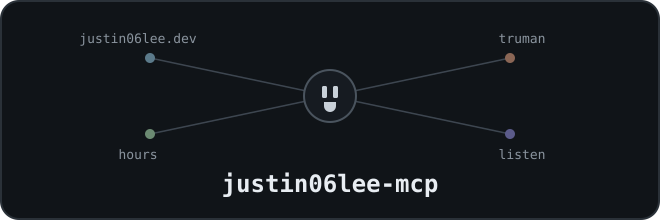

<div align="center">



# @justin06lee/mcp

**MCP server for the justin06lee.dev ecosystem — every admin surface, one socket.**<br>
*Portfolio, calendar, time tracking, uploads, the truman live room, the listen music room.*

</div>

---

81 tools over the ecosystem's HTTP APIs: the main site's portfolio items,
homepage bio and socials, calendar plans, categories, time tracking, image
uploads and article cache — plus the truman.justin06lee.dev live-video room,
the listen.justin06lee.dev synced music room, the todo.justin06lee.dev board
and notes, the coffee.justin06lee.dev booking page, the oddjob.justin06lee.dev
work-order inbox, and the leet.justin06lee.dev practice site.

## why it wraps HTTP and not the database

Most justin06lee.dev sites share one Turso database, so talking to it directly
is tempting. This server deliberately doesn't:

- The API routes own validation and the category/plan foreign-key checks.
- They call `revalidatePath()`. A direct database write changes the data and
  leaves the site serving a **stale cached page**.
- Anything the API can do, curl and cron can do too. Keeping the logic there
  means MCP is a thin wrapper, not the only way in.

The server holds one credential per app and exchanges each for the cookie that
app expects — none of the sites has a header-token auth path.

## it is not a daemon

Worth being explicit, because it's the thing most people get wrong: an MCP
stdio server is **not** a long-running service. The agent spawns it as a child
process and talks over stdin/stdout, the same way Otto already spawns
`otto-memory`. There is nothing to keep alive, no port, no tmux window, no
systemd unit.

The unit of deployment is a **binary in `~/.local/bin`** plus one entry in
`~/.config/otto/mcp.json`. That is the whole install.

Running it by hand just makes it sit there waiting for JSON-RPC on stdin. To
check it actually works, use `--doctor`.

## install

```bash
make            # build → install → verify credentials → register with Otto
```

(`make` runs `./install.sh`; both are idempotent — re-run to rebuild, rotate a
key, or repair the registration. Registration merges into Otto's `mcp.json`
without touching other servers and preserves optional env keys already
registered there, `0600`.)

Then restart Otto — or just run `make update`, which does both:

```bash
systemctl --user restart otto                  # Arch
launchctl kickstart -k gui/$UID/com.otto.bot   # macOS
```

> **Otto's `setup.sh` rewrites `mcp.json` from scratch** and will drop this
> entry. If you re-run it, re-run `make` afterwards.

### checking it works

```bash
justin06lee-mcp --doctor
```

Hits the live sites and reports auth, items, config, categories, timers,
uploads, the todo board, the coffee event types, the oddjob inbox, the leet
articles, the truman stream, and the listen room. Apps whose key is not set
are skipped, not failed. Non-zero exit on failure, so it works in a health
check.

### other agents

Nothing here is Otto-specific — it's a standard MCP stdio server:

```bash
claude mcp add justin06lee \
  --env ADMIN_KEY=... --env TRUMAN_OWNER_KEY=... --env LISTEN_OWNER_KEY=... \
  -- ~/.local/bin/justin06lee-mcp
```

## configuration

All configuration is environment variables — nothing is read from disk, no path
is baked into the build. That is what makes the same artifact run from a laptop,
a systemd unit, or a container.

| variable | default | notes |
|---|---|---|
| `SITE_URL` | `https://justin06lee.dev` | Main deployment to control. Point at `http://localhost:3000` to test against a dev database. |
| `ADMIN_KEY` | *(required)* | Same key the main site is deployed with. Grants full admin. |
| `TRUMAN_URL` | `https://truman.justin06lee.dev` | The live-video room. |
| `TRUMAN_OWNER_KEY` | *(optional)* | Enables the `truman_*` tools. Without it they register but fail with a clear message. |
| `LISTEN_URL` | `https://listen.justin06lee.dev` | The synced music room. |
| `LISTEN_OWNER_KEY` | *(optional)* | Enables `listen_set_room`; reading the room is public. |
| `TODO_URL` | `https://todo.justin06lee.dev` | The todo board + notes. Authenticates with the shared `ADMIN_KEY`. |
| `COFFEE_URL` | `https://coffee.justin06lee.dev` | The booking page. Shared `ADMIN_KEY`. |
| `ODDJOB_URL` | `https://oddjob.justin06lee.dev` | The work-order inbox. Shared `ADMIN_KEY`. |
| `LEET_URL` | `https://leet.justin06lee.dev` | The practice site. |
| `LEET_ADMIN_KEY` | *(optional)* | leet's own admin key (not the shared one). Enables the `leet_*` tools. |
| `REQUEST_TIMEOUT_MS` | `15000` | Raise if a site cold-starts slowly. |

## deploying to the tenet box

The binary embeds its own runtime, so the target machine needs **neither Node
nor Bun** — nothing to install, nothing to keep in sync.

```bash
make deploy     # cross-compile, scp to justin06lee@tenet, doctor there, restart Otto
```

(`REMOTE=user@host make deploy` targets a different machine.) To do it by hand
instead, `./install.sh --target linux-x64` leaves the artifact in `dist/` —
deliberately not `~/.local/bin`, since installing a foreign-arch binary over
the working one would break the local agent.

## tools

| area | tools |
|---|---|
| Portfolio items | `list_items` `create_item` `update_item` `move_item` `delete_item` |
| Site config | `get_site_config` `update_site_config` `reverse_geocode` `get_pats` |
| Calendar plans | `list_calendar_tasks` `create_calendar_task` `update_calendar_task` `delete_calendar_task` `get_prayer_times` |
| Categories | `list_calendar_categories` `create_calendar_category` `update_calendar_category` `delete_calendar_category` |
| Time tracking | `get_running_timers` `start_timer` `stop_timer` `list_time_entries` `create_time_entry` `update_time_entry` `delete_time_entry` |
| Uploads | `list_uploads` `upload_image` `delete_upload` |
| Articles | `revalidate_articles` `upload_article_image` |
| truman | `truman_stream_status` `truman_set_live` `truman_read_chat` `truman_post_chat` `truman_clear_chat` `truman_revoke_sessions` `truman_delete_episode` |
| listen | `listen_room_status` `listen_set_room` |
| todo | `todo_get_board` `todo_create_category` `todo_update_category` `todo_delete_category` `todo_clear_done_tasks` `todo_create_task` `todo_update_task` `todo_delete_task` `todo_list_notes` `todo_read_note` `todo_create_note` `todo_update_note` `todo_delete_note` |
| coffee | `coffee_list_bookings` `coffee_get_booking` `coffee_cancel_booking` `coffee_list_event_types` `coffee_create_event_type` `coffee_update_event_type` `coffee_delete_event_type` `coffee_get_availability` `coffee_set_weekly_availability` `coffee_add_date_override` `coffee_remove_date_override` `coffee_get_settings` `coffee_update_settings` |
| oddjob | `oddjob_list_requests` `oddjob_get_request` `oddjob_update_request` `oddjob_delete_request` `oddjob_get_attachment` |
| leet | `leet_list_articles` `leet_get_article` `leet_create_article` `leet_update_article` `leet_delete_article` `leet_list_problems` `leet_get_problem` `leet_create_problem` `leet_update_problem` `leet_delete_problem` `leet_set_problem_tests` |

Places where a tool is friendlier than the raw endpoint:

- **`update_item` is a real partial update.** The site's `PUT /api/items/:id` is
  a full replace that nulls any omitted column. The tool reads the current row
  and merges, so a one-field change stays a one-field change.
- **`get_running_timers` always returns a list.** The bare endpoint returns
  `204` with no body when nothing is running, which reads as a failure.
- **`delete_upload` verifies first.** The site's DELETE returns 200 even for a
  missing id; the tool checks existence so its result is truthful.
- **`truman_revoke_sessions` requires explicit intent.** The raw endpoint
  treats a missing id as "evict everyone" — the tool refuses unless you pass
  `id` or `all: true` explicitly.
- **`listen_set_room` documents its own blast radius.** The raw endpoint is a
  full replace of all four state fields; the tool fills safe defaults and tells
  the model to read before writing.

Note `hours.justin06lee.dev` needs no tools of its own: it shares the main
site's database and tables, so the calendar/timer tools above already read and
write the same lanes and subjects it displays.

## layout

```
Makefile              # make / build / install / update / deploy
install.sh            # build → ~/.local/bin → register with Otto
src/
├── index.ts          # entry: stdio transport, --doctor, --version
├── doctor.ts         # live connectivity + auth check across all apps
├── server.ts         # builds the server, registers tools — no transport
├── config.ts         # environment parsing
├── client.ts         # cookie-session + static-cookie HTTP clients
└── tools/
    ├── shared.ts     # validation limits mirrored from the sites
    ├── items.ts
    ├── site-config.ts
    ├── calendar.ts
    ├── timers.ts
    ├── uploads.ts
    ├── articles.ts
    ├── truman.ts
    ├── listen.ts
    ├── todo.ts
    ├── coffee.ts
    ├── oddjob.ts
    └── leet.ts
scripts/
├── smoke.ts          # boots the built server over stdio, asserts the manifest
└── deploy.sh         # cross-compile → scp → remote doctor → restart Otto
tests/behavior.test.ts  # tool logic against a mock site over a real MCP client
```

`server.ts` binds no transport. If a genuinely remote setup is ever wanted —
the agent on one machine, the server on another — that means adding an entry
point beside `index.ts` and no tool code changes. Until then, stdio is simpler
and has no listening port to secure.

## not covered

- **Giving pats** — `POST /api/pats` is Origin-gated to the site itself;
  forging the header to pat programmatically would defeat the site's own
  guard. Reading the count (`get_pats`) is fair game.
- **The article CMS** (create/save/delete/visibility) — lives behind `"use
  server"` actions on the main site with no HTTP routes. Only the two
  HTTP-reachable pieces (revalidate, desk image upload) are wrapped.
- **chrome.justin06lee.dev** — a static component registry; there is no
  server-side state to change.
- **truman's box routes** (stream reports, episode filing) — those belong to
  the camera machine's bearer key; this server never impersonates the box.
- **The public guest surfaces** of coffee (booking a slot, cancelling by
  token) and oddjob (submitting a work order) — those belong to visitors, and
  the admin tools above cover everything the owner would do about them.
- **leet's learner surface** (SRS reviews, sessions) — that data is the
  owner's own practice history; the `leet_*` tools cover the authoring side.

The admin APIs the `todo_*`, `coffee_*`, `oddjob_*`, and `leet_*` tools call
were added to those repos in Aug 2026 (each repo's `feat/admin-api`); before
that their mutations lived behind server actions no external caller could
reach.
